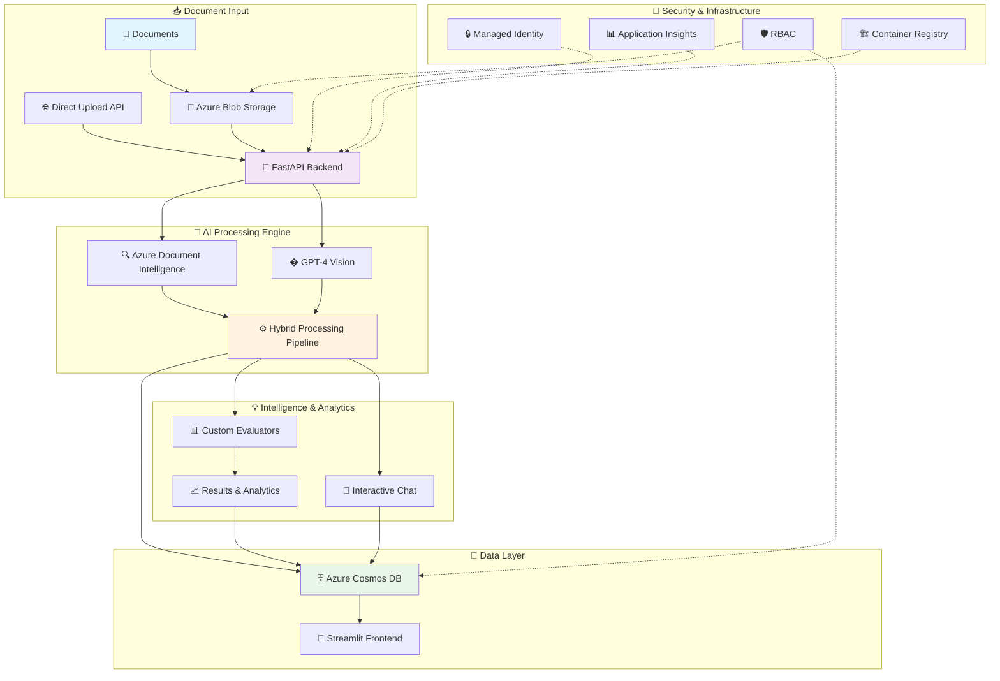

# 👁️ ARGUS: The All-Seeing Document Intelligence Platform

<div align="center">

[](https://azure.microsoft.com)
[](https://openai.com)
[](https://fastapi.tiangolo.com)
[](https://opensource.org/licenses/MIT)

*Named after Argus Panoptes, the mythological giant with a hundred eyes—ARGUS never misses a detail in your documents.*

</div>

## 🚀 Transform Document Processing with AI Intelligence

**ARGUS** revolutionizes how organizations extract, understand, and act on document data. By combining the precision of **Azure Document Intelligence** with the contextual reasoning of **GPT-4 Vision**, ARGUS doesn't just read documents—it *understands* them.

### 💡 Why ARGUS?

Traditional OCR solutions extract text but miss the context. AI-only approaches struggle with complex layouts. **ARGUS bridges this gap**, delivering enterprise-grade document intelligence that:

- **🎯 Extracts with Purpose**: Understands document context, not just text
- **⚡ Scales Effortlessly**: Process thousands of documents with cloud-native architecture
- **🔒 Secures by Design**: Enterprise security with managed identities and RBAC
- **🧠 Learns Continuously**: Configurable datasets adapt to your specific document types
- **📊 Measures Success**: Built-in evaluation tools ensure consistent accuracy

---

## 🌟 Key Capabilities

<table>
<tr>
<td width="50%">

### 🔍 **Intelligent Document Understanding**
- **Hybrid AI Pipeline**: Combines OCR precision with LLM reasoning
- **Context-Aware Extraction**: Understands relationships between data points
- **Multi-Format Support**: PDFs, images, forms, invoices, medical records
- **Zero-Shot Learning**: Works on new document types without training

### ⚡ **Enterprise-Ready Performance**
- **Cloud-Native Architecture**: Built on Azure Container Apps
- **Scalable Processing**: Handle document floods with confidence
- **Real-Time Processing**: API-driven workflows for immediate results
- **Event-Driven Automation**: Automatic processing on document upload

</td>
<td width="50%">

### 🎛️ **Advanced Control & Customization**
- **Dynamic Configuration**: Runtime settings without redeployment
- **Custom Datasets**: Tailor extraction for your specific needs
- **Interactive Chat**: Ask questions about processed documents
- **Concurrency Management**: Fine-tune performance for your workload

### 📈 **Comprehensive Analytics**
- **Built-in Evaluation**: Multiple accuracy metrics and comparisons
- **Performance Monitoring**: Application Insights integration
- **Custom Evaluators**: Fuzzy matching, semantic similarity, and more
- **Visual Analytics**: Jupyter notebooks for deep analysis

</td>
</tr>
</table>

---

## 🏗️ Architecture: Built for Scale and Security

ARGUS employs a modern, cloud-native architecture designed for enterprise workloads:

<div align="center">



</div>

### 🔧 Infrastructure Components

| Component | Technology | Purpose |
|-----------|------------|---------|
| **🚀 Backend API** | Azure Container Apps + FastAPI | High-performance document processing engine |
| **📱 Frontend UI** | Streamlit (Optional) | Interactive document management interface |
| **📁 Document Storage** | Azure Blob Storage | Secure, scalable document repository |
| **🗄️ Metadata Database** | Azure Cosmos DB | Results, configurations, and analytics |
| **🔍 OCR Engine** | Azure Document Intelligence | Structured text and layout extraction |
| **🧠 AI Reasoning** | Azure OpenAI (GPT-4 Vision) | Contextual understanding and extraction |
| **🏗️ Container Registry** | Azure Container Registry | Private, secure container images |
| **🔒 Security** | Managed Identity + RBAC | Zero-credential architecture |
| **📊 Monitoring** | Application Insights | Performance and health monitoring |

---

## ⚡ Quick Start: Deploy in Minutes

### 📋 Prerequisites

<details>
<summary><b>🛠️ Required Tools (Click to expand)</b></summary>

1. **Docker**
   ```bash
   # Install Docker (required for containerization during deployment)
   # Visit https://docs.docker.com/get-docker/ for installation instructions
   ```

2. **Azure Developer CLI (azd)**
   ```bash
   curl -fsSL https://aka.ms/install-azd.sh | bash
   ```

3. **Azure CLI**
   ```bash
   curl -sL https://aka.ms/InstallAzureCLIDeb | sudo bash
   ```

4. **Azure OpenAI Resource** 
   - Create an Azure OpenAI resource in a [supported region](https://docs.microsoft.com/azure/cognitive-services/openai/overview#regional-availability)
   - Deploy a vision-capable model: `gpt-4o`, `gpt-4-turbo`, or `gpt-4` (with vision)
   - Collect: endpoint URL, API key, and deployment name

</details>

### 🚀 One-Command Deployment

```bash
# 1. Clone the repository
git clone https://github.com/Azure-Samples/ARGUS.git
cd ARGUS

# 2. Login to Azure
az login

# 3. Configure your Azure OpenAI credentials
cp .env.template .env
# Edit .env with your Azure OpenAI details

# 4. Deploy everything with a single command
azd up
```

**That's it!** 🎉 Your ARGUS instance is now running in the cloud.

### ✅ Verify Your Deployment

```bash
# Check system health
curl "$(azd env get-value BACKEND_URL)/health"

# Expected response:
{
  "status": "healthy",
  "services": {
    "cosmos_db": "✅ connected",
    "blob_storage": "✅ connected", 
    "document_intelligence": "✅ connected",
    "azure_openai": "✅ connected"
  }
}

# View live application logs
azd logs --follow
```

---

## 🎮 Usage Examples: See ARGUS in Action

### 📄 Example 1: Process an Invoice

```bash
# Upload an invoice to process
az storage blob upload \
  --account-name "$(azd env get-value STORAGE_ACCOUNT_NAME)" \
  --container-name "datasets" \
  --name "default-dataset/invoice-2024.pdf" \
  --file "./my-invoice.pdf" \
  --auth-mode login

# Process it with ARGUS
curl -X POST \
  -H "Content-Type: application/json" \
  -d '{
    "blob_url": "https://mystorage.blob.core.windows.net/datasets/default-dataset/invoice-2024.pdf"
  }' \
  "$(azd env get-value BACKEND_URL)/api/process-blob"

# Response includes extracted data:
{
  "status": "success",
  "extraction_results": {
    "invoice_number": "INV-2024-001",
    "total_amount": "$1,250.00",
    "vendor_name": "Acme Corp",
    "line_items": [...]
  },
  "confidence_score": 0.94,
  "processing_time": "2.3s"
}
```

### 💬 Example 2: Interactive Document Chat

```bash
# Ask questions about any processed document
curl -X POST \
  -H "Content-Type: application/json" \
  -d '{
    "blob_url": "https://mystorage.blob.core.windows.net/datasets/default-dataset/contract.pdf",
    "question": "What are the key terms and conditions in this contract?"
  }' \
  "$(azd env get-value BACKEND_URL)/api/chat"

# Get intelligent answers:
{
  "answer": "The key terms include: 1) 12-month service agreement, 2) $5000/month fee, 3) 30-day termination clause...",
  "confidence": 0.91,
  "sources": ["page 1, paragraph 3", "page 2, section 2.1"]
}
```

### 📤 Example 3: Direct File Upload

```bash
# Process a file without pre-uploading to storage
curl -X POST \
  -F "file=@./medical-form.pdf" \
  -F "dataset_name=medical-dataset" \
  "$(azd env get-value BACKEND_URL)/api/process-file"
```

---

## 🎛️ Advanced Configuration

### 📊 Dataset Management

ARGUS supports unlimited custom document types through configurable datasets:

<details>
<summary><b>🗂️ Built-in Datasets</b></summary>

- **`default-dataset/`**: Invoices, receipts, general business documents
- **`medical-dataset/`**: Medical forms, prescriptions, healthcare documents

</details>

<details>
<summary><b>🔧 Create Custom Datasets</b></summary>

You can create custom datasets either manually in Cosmos DB or through the Streamlit frontend interface:

**Option 1: Using the Frontend (Recommended)**
1. Access the Streamlit frontend (deployed automatically with azd)
2. Navigate to the Settings tab
3. Create a new dataset with custom prompts and schema

**Option 2: Manual Setup**
1. **Create dataset structure**:
   ```bash
   mkdir demo/financial-reports
   ```

2. **Define extraction instructions** (`system_prompt.txt`):
   ```text
   Extract financial data from quarterly reports with focus on:
   - Revenue figures and growth percentages
   - Key performance indicators
   - Risk factors and forward-looking statements
   - Executive summary highlights
   ```

3. **Specify output format** (`output_schema.json`):
   ```json
   {
     "company_name": "",
     "quarter": "",
     "revenue": "",
     "growth_rate": "",
     "key_metrics": {
       "profit_margin": "",
       "cash_flow": "",
       "debt_ratio": ""
     },
     "forward_outlook": ""
   }
   ```

4. **Upload documents**:
   ```bash
   az storage blob upload \
     --container-name "datasets" \
     --name "financial-reports/q3-2024.pdf" \
     --file "./report.pdf"
   ```

</details>

---

## 🖥️ Frontend Interface: User-Friendly Document Management

The Streamlit frontend is **automatically deployed** with `azd up` and provides a user-friendly interface for document management.

<div align="center">

</div>

### 🎯 Frontend Features

| Tab | Functionality |
|-----|---------------|
| **🧠 Process Files** | Drag-and-drop document upload with real-time processing status |
| **🔍 Explore Data** | Browse processed documents, search results, view extraction details |
| **⚙️ Settings** | Configure datasets, adjust processing parameters, manage connections |
| **📋 Instructions** | Interactive help, API documentation, and usage examples |

---

## ️ Development & Customization

### 🏗️ Backend Architecture Deep Dive

```
src/containerapp/
├── 🚀 main.py              # FastAPI app & route definitions
├── 🔌 api_routes.py        # API endpoint implementations  
├── 🔧 dependencies.py      # Azure service client management
├── 📋 models.py           # Data models & validation schemas
├── ⚙️ blob_processing.py   # Document processing pipeline
├── 🎛️ logic_app_manager.py # Concurrency & workflow management
└── 🧠 ai_ocr/             # Core AI processing engine
    ├── 🔍 process.py      # Main processing orchestration
    ├── 🔗 chains.py       # LangChain integration & workflows
    ├── 🤖 model.py        # Azure OpenAI client & prompting
    └── ⏱️ timeout.py      # Processing timeout & error handling
```

### 🧪 Local Development Setup

```bash
# Setup development environment
cd src/containerapp
python -m venv venv
source venv/bin/activate  # or `venv\Scripts\activate` on Windows
pip install -r requirements.txt

# Configure local environment
cp ../../.env.template .env
# Edit .env with your development credentials

# Run with hot reload
uvicorn main:app --reload --host 0.0.0.0 --port 8000

# Access API documentation
open http://localhost:8000/docs
```

### 🔧 Key Technologies & Libraries

| Category | Technologies |
|----------|-------------|
| **🚀 API Framework** | FastAPI, Uvicorn, Pydantic |
| **🧠 AI/ML** | LangChain, OpenAI SDK, Azure AI SDK |
| **☁️ Azure Services** | Azure SDK (Blob, Cosmos, Document Intelligence) |
| **📄 Document Processing** | PyMuPDF, Pillow, PyPDF2 |
| **📊 Data & Analytics** | Pandas, NumPy, Matplotlib |
| **🔒 Security** | Azure Identity, managed identities |

---

##  API Reference: Complete Documentation

### 🚀 Core Processing Endpoints

<details>
<summary><b>📄 POST /api/process-blob - Process Document from Storage</b></summary>

**Request**:
```json
{
  "blob_url": "https://storage.blob.core.windows.net/datasets/default-dataset/invoice.pdf",
  "dataset_name": "default-dataset",
  "priority": "normal",
  "webhook_url": "https://your-app.com/webhooks/argus",
  "metadata": {
    "source": "email_attachment",
    "user_id": "user123"
  }
}
```

**Response**:
```json
{
  "status": "success",
  "job_id": "job_12345",
  "extraction_results": {
    "invoice_number": "INV-2024-001",
    "total_amount": "$1,250.00",
    "confidence_score": 0.94
  },
  "processing_time": "2.3s",
  "timestamp": "2024-01-15T10:30:00Z"
}
```

</details>

<details>
<summary><b>📤 POST /api/process-file - Direct File Upload</b></summary>

**Request** (multipart/form-data):
```
file: [PDF/Image file]
dataset_name: "default-dataset"
priority: "high"
```

**Response**:
```json
{
  "status": "success",
  "job_id": "job_12346",
  "blob_url": "https://storage.blob.core.windows.net/temp/uploaded_file.pdf",
  "extraction_results": {...},
  "processing_time": "1.8s"
}
```

</details>

<details>
<summary><b>💬 POST /api/chat - Interactive Document Q&A</b></summary>

**Request**:
```json
{
  "blob_url": "https://storage.blob.core.windows.net/datasets/contract.pdf",
  "question": "What are the payment terms and penalties for late payment?",
  "context": "focus on financial obligations",
  "temperature": 0.1
}
```

**Response**:
```json
{
  "answer": "Payment terms are Net 30 days. Late payment penalty is 1.5% per month on outstanding balance...",
  "confidence": 0.91,
  "sources": [
    {"page": 2, "section": "Payment Terms"},
    {"page": 5, "section": "Default Provisions"}
  ],
  "processing_time": "1.2s"
}
```

</details>

### ⚙️ Configuration Management

<details>
<summary><b>🔧 GET/POST /api/configuration - System Configuration</b></summary>

**GET Response**:
```json
{
  "openai_settings": {
    "endpoint": "https://your-openai.openai.azure.com/",
    "model": "gpt-4o",
    "temperature": 0.1,
    "max_tokens": 4000
  },
  "processing_settings": {
    "max_concurrent_jobs": 5,
    "timeout_seconds": 300,
    "retry_attempts": 3
  },
  "datasets": ["default-dataset", "medical-dataset", "financial-reports"]
}
```

**POST Request**:
```json
{
  "openai_settings": {
    "temperature": 0.05,
    "max_tokens": 6000
  },
  "processing_settings": {
    "max_concurrent_jobs": 8
  }
}
```

</details>

### 📊 Monitoring & Analytics

<details>
<summary><b>📈 GET /api/metrics - Performance Metrics</b></summary>

**Response**:
```json
{
  "period": "last_24h",
  "summary": {
    "total_documents": 1247,
    "successful_extractions": 1198,
    "failed_extractions": 49,
    "success_rate": 96.1,
    "avg_processing_time": "2.3s"
  },
  "performance": {
    "p50_processing_time": "1.8s",
    "p95_processing_time": "4.2s",
    "p99_processing_time": "8.1s"
  },
  "errors": {
    "ocr_failures": 12,
    "ai_timeouts": 8,
    "storage_issues": 3,
    "other": 26
  }
}
```

</details>

---

## 🧪 Testing & Quality Assurance

ARGUS includes built-in evaluation tools for accuracy assessment. Use the Jupyter notebook in the `notebooks/` directory to run comprehensive evaluations:

```bash
# Setup evaluation environment
cd notebooks
pip install -r requirements.txt
cp ../.env.template .env  # Add your credentials

# Launch evaluation dashboard
jupyter notebook evaluator.ipynb
```

The evaluation notebook provides performance metrics, field-level analysis, and comparative assessments using various evaluation methods including fuzzy string matching and semantic similarity.

---

## 🤝 Contributing & Community

### 🎯 How to Contribute

We welcome contributions! Here's how to get started:

1. **🍴 Fork & Clone**:
   ```bash
   git clone https://github.com/your-username/ARGUS.git
   cd ARGUS
   ```

2. **🌿 Create Feature Branch**:
   ```bash
   git checkout -b feature/amazing-improvement
   ```

3. **🧪 Develop & Test**:
   ```bash
   # Setup development environment
   ./scripts/setup-dev.sh
   
   # Run tests
   pytest tests/ -v
   
   # Lint code
   black src/ && flake8 src/
   ```

4. **📝 Document Changes**:
   ```bash
   # Update documentation
   # Add examples to README
   # Update API documentation
   ```

5. **🚀 Submit PR**:
   ```bash
   git commit -m "feat: add amazing improvement"
   git push origin feature/amazing-improvement
   # Create pull request on GitHub
   ```

### 📋 Contribution Guidelines

| Type | Guidelines |
|------|------------|
| **🐛 Bug Fixes** | Include reproduction steps, expected vs actual behavior |
| **✨ New Features** | Discuss in issues first, include tests and documentation |
| **📚 Documentation** | Clear examples, practical use cases, proper formatting |
| **🔧 Performance** | Benchmark results, before/after comparisons |

### 🏆 Recognition

Contributors will be recognized in:
- 📝 Release notes for significant contributions
- 🌟 Contributors section (with permission)
- 💬 Community showcase for innovative use cases

---

## 📞 Support & Resources

### 💬 Getting Help

| Resource | Description | Link |
|----------|-------------|------|
| **📚 Documentation** | Complete setup and usage guides | [docs/](docs/) |
| **🐛 Issue Tracker** | Bug reports and feature requests | [GitHub Issues](https://github.com/Azure-Samples/ARGUS/issues) |
| **💡 Discussions** | Community Q&A and ideas | [GitHub Discussions](https://github.com/Azure-Samples/ARGUS/discussions) |
| **📧 Team Contact** | Direct contact for enterprise needs | See team section below |

### 🔗 Additional Resources

- **📖 Azure Document Intelligence**: [Official Documentation](https://docs.microsoft.com/azure/applied-ai-services/form-recognizer/)
- **🤖 Azure OpenAI**: [Service Documentation](https://docs.microsoft.com/azure/cognitive-services/openai/)
- **⚡ FastAPI**: [Framework Documentation](https://fastapi.tiangolo.com/)
- **🐍 LangChain**: [Integration Guides](https://python.langchain.com/)

---

## 👥 Team

- **Alberto Gallo** - AI Architecture & Processing Pipeline
- **Petteri Johansson** - Cloud Infrastructure & DevOps  
- **Christin Pohl** - Security & Compliance
- **Konstantinos Mavrodis** - Platform Engineering & Performance

## License

This project is licensed under the **MIT License** - see the [LICENSE](LICENSE) file for details.

---

<div align="center">

## 🚀 Ready to Transform Your Document Processing?

**Deploy ARGUS in minutes and start extracting intelligence from your documents today!**

```bash
git clone https://github.com/Azure-Samples/ARGUS.git && cd ARGUS && azd up
```

<br>

[](https://portal.azure.com/#create/Microsoft.Template)
[](https://vscode.dev/redirect?url=vscode://ms-vscode-remote.remote-containers/cloneInVolume?url=https://github.com/Azure-Samples/ARGUS)

<br>

**⭐ Star this repo if ARGUS helps your document processing needs!**

</div>
