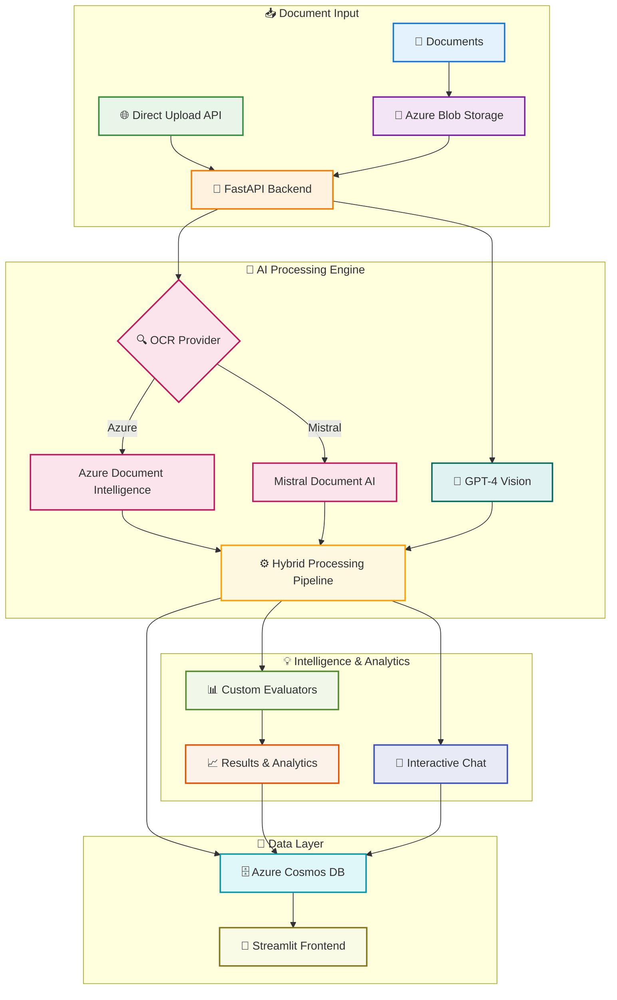
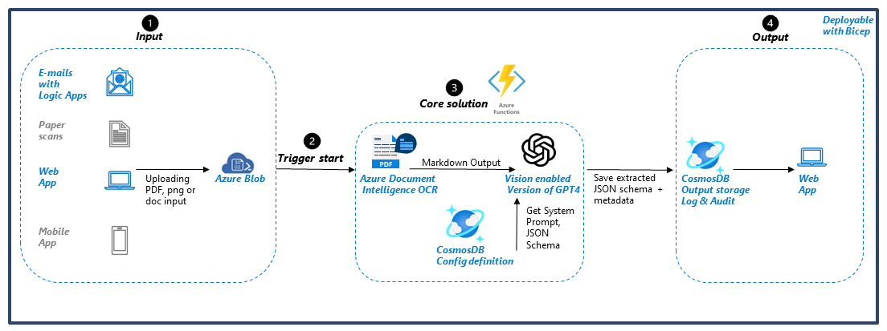

# 👁️ ARGUS: The All-Seeing Document Intelligence Platform

<div align="center">

[](https://azure.microsoft.com)
[](https://openai.com)
[](https://fastapi.tiangolo.com)
[](https://opensource.org/licenses/MIT)

*Named after Argus Panoptes, the mythological giant with a hundred eyes—ARGUS never misses a detail in your documents.*

</div>

## 🚀 Transform Document Processing with AI Intelligence

**ARGUS** revolutionizes how organizations extract, understand, and act on document data. By combining the precision of **Azure Document Intelligence** with the contextual reasoning of **GPT-4 Vision**, ARGUS doesn't just read documents—it *understands* them.

### 💡 Why ARGUS?

Traditional OCR solutions extract text but miss the context. AI-only approaches struggle with complex layouts. **ARGUS bridges this gap**, delivering enterprise-grade document intelligence that:

- **🎯 Extracts with Purpose**: Understands document context, not just text
- **⚡ Scales Effortlessly**: Process thousands of documents with cloud-native architecture
- **🔒 Secures by Design**: Enterprise security with managed identities and RBAC
- **🧠 Learns Continuously**: Configurable datasets adapt to your specific document types
- **📊 Measures Success**: Built-in evaluation tools ensure consistent accuracy

---

## 🌟 Key Capabilities

<table>
<tr>
<td width="50%">

### 🔍 **Intelligent Document Understanding**
- **Hybrid AI Pipeline**: Combines OCR precision with LLM reasoning
- **Multiple OCR Providers**: Azure Document Intelligence or Mistral Document AI
- **Context-Aware Extraction**: Understands relationships between data points
- **Multi-Format Support**: PDFs, images, forms, invoices, medical records
- **Zero-Shot Learning**: Works on new document types without training

### ⚡ **Enterprise-Ready Performance**
- **Cloud-Native Architecture**: Built on Azure Container Apps
- **Scalable Processing**: Handle document floods with confidence
- **Real-Time Processing**: API-driven workflows for immediate results
- **Event-Driven Automation**: Automatic processing on document upload

</td>
<td width="50%">

### 🎛️ **Advanced Control & Customization**
- **Dynamic Configuration**: Runtime settings without redeployment
- **Custom Datasets**: Tailor extraction for your specific needs
- **Interactive Chat**: Ask questions about processed documents
- **Concurrency Management**: Fine-tune performance for your workload

### 📈 **Comprehensive Analytics**
- **Built-in Evaluation**: Multiple accuracy metrics and comparisons
- **Performance Monitoring**: Application Insights integration
- **Custom Evaluators**: Fuzzy matching, semantic similarity, and more
- **Visual Analytics**: Jupyter notebooks for deep analysis

</td>
</tr>
</table>

---

## 🏗️ Architecture: Built for Scale and Security

ARGUS employs a modern, cloud-native architecture designed for enterprise workloads:

<div align="center">



</div>

### 🔧 Infrastructure Components

| Component | Technology | Purpose |
|-----------|------------|---------|
| **🚀 Backend API** | Azure Container Apps + FastAPI | High-performance document processing engine |
| **📱 Frontend UI** | Streamlit (Optional) | Interactive document management interface |
| **📁 Document Storage** | Azure Blob Storage | Secure, scalable document repository |
| **🗄️ Metadata Database** | Azure Cosmos DB | Results, configurations, and analytics |
| **🔍 OCR Engine** | Azure Document Intelligence or Mistral Document AI | Structured text and layout extraction |
| **🧠 AI Reasoning** | Azure OpenAI (GPT-4 Vision) | Contextual understanding and extraction |
| **🏗️ Container Registry** | Azure Container Registry | Private, secure container images |
| **🔒 Security** | Managed Identity + RBAC | Zero-credential architecture |
| **📊 Monitoring** | Application Insights | Performance and health monitoring |

---

## ⚡ Quick Start: Deploy in Minutes

### 📋 Prerequisites

<details>
<summary><b>🛠️ Required Tools (Click to expand)</b></summary>

1. **Docker**
   ```bash
   # Install Docker (required for containerization during deployment)
   # Visit https://docs.docker.com/get-docker/ for installation instructions
   ```

2. **Azure Developer CLI (azd)**
   ```bash
   curl -fsSL https://aka.ms/install-azd.sh | bash
   ```

3. **Azure CLI**
   ```bash
   curl -sL https://aka.ms/InstallAzureCLIDeb | sudo bash
   ```

4. **Azure OpenAI Resource** 
   - Create an Azure OpenAI resource in a [supported region](https://docs.microsoft.com/azure/cognitive-services/openai/overview#regional-availability)
   - Deploy a vision-capable model: `gpt-4o`, `gpt-4-turbo`, or `gpt-4` (with vision)
   - Collect: endpoint URL, API key, and deployment name

</details>

### 🚀 One-Command Deployment

```bash
# 1. Clone the repository
git clone https://github.com/Azure-Samples/ARGUS.git
cd ARGUS

# 2. Login to Azure
az login

# 3. Deploy everything with a single command
azd up
```

**That's it!** 🎉 Your ARGUS instance is now running in the cloud.

### ✅ Verify Your Deployment

```bash
# Check system health
curl "$(azd env get-value BACKEND_URL)/health"

# Expected response:
{
  "status": "healthy",
  "services": {
    "cosmos_db": "✅ connected",
    "blob_storage": "✅ connected", 
    "document_intelligence": "✅ connected",
    "azure_openai": "✅ connected"
  }
}

# View live application logs
azd logs --follow
```

---

## 🎮 Usage Examples: See ARGUS in Action

### 📄 Method 1: Upload via Frontend Interface (Recommended)

The easiest way to process documents is through the user-friendly web interface:

1. **Access the Frontend**:
   ```bash
   # Get the frontend URL after deployment
   azd env get-value FRONTEND_URL
   ```

2. **Upload and Process Documents**:
   - Navigate to the **"🧠 Process Files"** tab
   - Select your dataset from the dropdown (e.g., "default-dataset", "medical-dataset")
   - Use the **file uploader** to select PDF, image, or Office documents
   - Click **"Submit"** to upload files
   - Files are automatically processed using the selected dataset's configuration
   - Monitor processing status in the **"🔍 Explore Data"** tab

### 📤 Method 2: Direct Blob Storage Upload

For automation or bulk processing, upload files directly to Azure Blob Storage:

```bash
# Upload a document to be processed automatically
az storage blob upload \
  --account-name "$(azd env get-value STORAGE_ACCOUNT_NAME)" \
  --container-name "datasets" \
  --name "default-dataset/invoice-2024.pdf" \
  --file "./my-invoice.pdf" \
  --auth-mode login

# Files uploaded to blob storage are automatically detected and processed
# Results can be viewed in the frontend or retrieved via API
```

### 💬 Example 3: Interactive Document Chat

Ask questions about any processed document through the API:

```bash
curl -X POST \
  -H "Content-Type: application/json" \
  -d '{
    "blob_url": "https://mystorage.blob.core.windows.net/datasets/default-dataset/contract.pdf",
    "question": "What are the key terms and conditions in this contract?"
  }' \
  "$(azd env get-value BACKEND_URL)/api/chat"

# Get intelligent answers:
{
  "answer": "The key terms include: 1) 12-month service agreement, 2) $5000/month fee, 3) 30-day termination clause...",
  "confidence": 0.91,
  "sources": ["page 1, paragraph 3", "page 2, section 2.1"]
}
```

---

## 🤖 MCP Integration: AI-Powered Document Access

ARGUS supports the **Model Context Protocol (MCP)** using the modern **Streamable HTTP transport**, enabling AI assistants like GitHub Copilot, Claude, and other MCP-compatible clients to interact directly with your document intelligence platform.

### 🔌 What is MCP?

The [Model Context Protocol](https://modelcontextprotocol.io/) is an open standard that allows AI assistants to securely connect to external data sources and tools. With ARGUS MCP support, your AI assistant can:

- 📄 **List and search documents** across all your datasets
- 🔍 **Query document content** and extracted data
- 💬 **Chat with documents** using natural language
- 📤 **Upload new documents** for processing
- ⚙️ **Manage datasets** and configurations

### ⚡ Quick Setup

Add ARGUS to your MCP client configuration:

**VS Code / GitHub Copilot** (`~/.vscode/mcp.json` or workspace settings):
```json
{
  "mcpServers": {
    "argus": {
      "url": "https://<your-backend-url>/mcp"
    }
  }
}
```

> **Tip**: After deployment with `azd up`, get your backend URL from the Azure Portal or run `azd show` to find the Container App URL.

**Claude Desktop** (`~/Library/Application Support/Claude/claude_desktop_config.json`):
```json
{
  "mcpServers": {
    "argus": {
      "url": "https://<your-backend-url>/mcp"
    }
  }
}
```

> **Note**: ARGUS uses the Streamable HTTP transport (the modern MCP standard). The endpoint is a single `/mcp` path that handles all MCP communication.

### 🛠️ Available MCP Tools

| Tool | Description |
|------|-------------|
| `argus_list_documents` | List all processed documents with filtering options |
| `argus_get_document` | Get detailed document information including OCR and extraction results |
| `argus_chat_with_document` | Ask natural language questions about a document |
| `argus_search_documents` | Search documents by keyword across all datasets |
| `argus_list_datasets` | List available dataset configurations |
| `argus_get_dataset_config` | Get system prompt and schema for a dataset |
| `argus_create_dataset` | Create a new dataset with custom prompt and schema |
| `argus_process_document_url` | Queue a document for processing from blob URL |
| `argus_get_extraction` | Get extracted structured data from a document |
| `argus_get_upload_url` | Get a pre-signed SAS URL for direct document upload |

### 💡 Example Interactions

Once configured, you can interact with ARGUS through your AI assistant:

```
User: "Show me all invoices processed in the last week"
AI: [Uses argus_list_documents to retrieve recent invoices]

User: "What's the total amount on invoice INV-2024-001?"
AI: [Uses argus_get_document to fetch invoice details]

User: "I need to upload a new contract for processing"
AI: [Uses argus_get_upload_url to get a secure upload link]

User: "Compare the extraction results between these two invoices"
AI: [Uses argus_get_extraction on both documents and compares]

User: "Create a new dataset for processing purchase orders"
AI: [Uses argus_create_dataset with appropriate prompt and schema]
```


---

## 🎛️ Advanced Configuration

### 📊 Dataset Management

ARGUS uses **datasets** to define how different types of documents should be processed. A dataset contains:
- **Model Prompt**: Instructions telling the AI how to extract data from documents
- **Output Schema**: The target structure for extracted data (can be empty to let AI determine the structure)
- **Processing Options**: Settings for OCR, image analysis, summarization, and evaluation

**When to create custom datasets**: Create a new dataset when you have a specific document type that requires different extraction logic than the built-in datasets (e.g., contracts, medical reports, financial statements).

<details>
<summary><b>🗂️ Built-in Datasets</b></summary>

- **`default-dataset/`**: Invoices, receipts, general business documents
- **`medical-dataset/`**: Medical forms, prescriptions, healthcare documents

</details>

<details>
<summary><b>🔧 Create Custom Datasets</b></summary>

Datasets are managed through the Streamlit frontend interface (deployed automatically with azd):

1. **Access the frontend** (URL provided after azd deployment)
2. **Navigate to the Process Files tab**
3. **Scroll to "Add New Dataset" section**
4. **Configure your dataset**:
   - Enter dataset name (e.g., "legal-contracts")
   - Define model prompt with extraction instructions
   - Specify output schema (JSON format) or leave empty
   - Set processing options (OCR, images, evaluation)
5. **Click "Add New Dataset"** - it's saved directly to Cosmos DB

</details>

---

### � OCR Provider Configuration

ARGUS supports **two OCR providers** for document text extraction:

- **Azure Document Intelligence** (Default): Microsoft's enterprise OCR service with advanced layout understanding
- **Mistral Document AI**: Mistral's document processing service with markdown-optimized output

<details>
<summary><b>🔧 Configure OCR Provider</b></summary>

**Via Frontend (Recommended)**:
1. Navigate to **Settings** tab in the web interface
2. Select **OCR Provider** section
3. Choose your provider:
   - **Azure**: Uses Azure Document Intelligence (automatically configured during deployment)
   - **Mistral**: Requires additional configuration (endpoint, API key, model name)
4. For Mistral, enter:
   - **Mistral Endpoint**: Your Mistral Document AI API endpoint URL
   - **Mistral API Key**: Your Mistral API authentication key
   - **Mistral Model**: Model name (default: `mistral-document-ai-2505`)
5. Click **"Update OCR Provider"** to apply changes

**Via Environment Variables**:
Set the following environment variables in your deployment:

```bash
# Choose OCR provider
OCR_PROVIDER=mistral  # or "azure" (default)

# Mistral-specific configuration (only needed if OCR_PROVIDER=mistral)
MISTRAL_DOC_AI_ENDPOINT=https://your-endpoint.services.ai.azure.com/providers/mistral/azure/ocr
MISTRAL_DOC_AI_KEY=your-mistral-api-key
MISTRAL_DOC_AI_MODEL=mistral-document-ai-2505
```

**Update via Azure Portal**:
1. Navigate to Azure Portal → Container Apps → Your Backend App
2. Go to **Settings** → **Environment variables**
3. Add/update the variables listed above
4. **Restart** the container app

**Update via Azure CLI**:
```bash
# Switch to Mistral
az containerapp update \
  --name <your-backend-app-name> \
  --resource-group <your-resource-group> \
  --set-env-vars \
    OCR_PROVIDER="mistral" \
    MISTRAL_DOC_AI_ENDPOINT="https://your-endpoint.../ocr" \
    MISTRAL_DOC_AI_KEY="your-api-key" \
    MISTRAL_DOC_AI_MODEL="mistral-document-ai-2505"

# Switch back to Azure
az containerapp update \
  --name <your-backend-app-name> \
  --resource-group <your-resource-group> \
  --set-env-vars OCR_PROVIDER="azure"
```

**Note**: OCR provider selection is configured at the solution level and applies to all document processing operations.

</details>

---

The Streamlit frontend is **automatically deployed** with `azd up` and provides a user-friendly interface for document management.

<div align="center">

</div>

### 🎯 Frontend Features

| Tab | Functionality |
|-----|---------------|
| **🧠 Process Files** | Drag-and-drop document upload with real-time processing status |
| **🔍 Explore Data** | Browse processed documents, search results, view extraction details |
| **⚙️ Settings** | Configure datasets, adjust processing parameters, manage connections |
| **📋 Instructions** | Interactive help, API documentation, and usage examples |

---

## ️ Development & Customization

### 🏗️ Project Structure Deep Dive

```
ARGUS/
├── 📋 azure.yaml                        # Azure Developer CLI configuration
├── 📄 README.md                         # Project documentation & setup guide
├── 📄 LICENSE                           # MIT license file
├── 📄 CONTRIBUTING.md                   # Contribution guidelines
├── 📄 sample-invoice.pdf                # Sample document for testing
├── 🔧 .env.template                     # Environment variables template
├── 📂 .github/                          # GitHub Actions & workflows
├── 📂 .devcontainer/                    # Development container configuration
├── 📂 .vscode/                          # VS Code settings & extensions
│
├── 📂 infra/                            # 🏗️ Azure Infrastructure as Code
│   ├── ⚙️ main.bicep                    # Primary Bicep template for Azure resources
│   ├── ⚙️ main.parameters.json          # Infrastructure parameters & configuration
│   ├── ⚙️ main-containerapp.bicep       # Container App specific infrastructure
│   ├── ⚙️ main-containerapp.parameters.json # Container App parameters
│   └── 📋 abbreviations.json            # Azure resource naming abbreviations
│
├── 📂 src/                              # 🚀 Core Application Source Code
│   ├── 📂 containerapp/                 # FastAPI Backend Service
│   │   ├── 🚀 main.py                   # FastAPI app lifecycle & configuration
│   │   ├── 🔌 api_routes.py             # HTTP endpoints & request handlers
│   │   ├── 🔧 dependencies.py           # Azure client initialization & management
│   │   ├── 📋 models.py                 # Pydantic data models & schemas
│   │   ├── ⚙️ blob_processing.py        # Document processing pipeline orchestration
│   │   ├── 🎛️ logic_app_manager.py     # Azure Logic Apps concurrency management
│   │   ├── 🐳 Dockerfile                # Container image definition
│   │   ├── 📦 requirements.txt          # Python dependencies
│   │   ├── 📄 REFACTORING_SUMMARY.md    # Architecture documentation
│   │   │
│   │   ├── 📂 ai_ocr/                   # 🧠 AI Processing Engine
│   │   │   ├── 🔍 process.py            # Main processing orchestration & workflow
│   │   │   ├── 🔗 chains.py             # LangChain integration & AI workflows
│   │   │   ├── 🤖 model.py              # Configuration models & data structures
│   │   │   ├── ⏱️ timeout.py            # Processing timeout management
│   │   │   │
│   │   │   └── 📂 azure/                # ☁️ Azure Service Integrations
│   │   │       ├── ⚙️ config.py         # Environment & configuration management
│   │   │       ├── 📄 doc_intelligence.py # Azure Document Intelligence OCR
│   │   │       ├── 🖼️ images.py         # PDF to image conversion utilities
│   │   │       └── 🤖 openai_ops.py     # Azure OpenAI API operations
│   │   │
│   │   ├── 📂 example-datasets/         # 📊 Default Dataset Configurations
│   │   ├── 📂 datasets/                 # 📁 Runtime dataset storage
│   │   └── 📂 evaluators/               # 📈 Data quality evaluation modules
│   │
│   └── 📂 evaluators/                   # 🧪 Evaluation Framework
│       ├── 📋 field_evaluator_base.py   # Abstract base class for evaluators
│       ├── 🔤 fuzz_string_evaluator.py  # Fuzzy string matching evaluation
│       ├── 🎯 cosine_similarity_string_evaluator.py # Semantic similarity evaluation
│       ├── 🎛️ custom_string_evaluator.py # Custom evaluation logic
│       ├── 📊 json_evaluator.py         # JSON structure validation
│       └── 📂 tests/                    # Unit tests for evaluators
│
├── 📂 frontend/                         # 🖥️ Streamlit Web Interface
│   ├── 📱 app.py                        # Main Streamlit application entry point
│   ├── 🔄 backend_client.py             # API client for backend communication
│   ├── 📤 process_files.py              # File upload & processing interface
│   ├── 🔍 explore_data.py               # Document browsing & analysis UI
│   ├── 💬 document_chat.py              # Interactive document Q&A interface
│   ├── 📋 instructions.py               # Help & documentation tab
│   ├── ⚙️ settings.py                   # Configuration management UI
│   ├── 🎛️ concurrency_management.py    # Performance tuning interface
│   ├── 📊 concurrency_settings.py      # Concurrency configuration utilities
│   ├── 🐳 Dockerfile                    # Frontend container definition
│   ├── 📦 requirements.txt              # Python dependencies for frontend
│   └── 📂 static/                       # Static assets (logos, images)
│       └── 🖼️ logo.png                  # ARGUS brand logo
│
├── 📂 demo/                             # 📋 Sample Datasets & Examples
│   ├── 📂 default-dataset/              # General business documents dataset
│   │   ├── 📄 system_prompt.txt         # AI extraction instructions
│   │   ├── 📊 output_schema.json        # Expected data structure
│   │   ├── 📄 ground_truth.json         # Validation reference data
│   │   └── 📄 Invoice Sample.pdf        # Sample document for testing
│   │
│   └── 📂 medical-dataset/              # Healthcare documents dataset
│       ├── 📄 system_prompt.txt         # Medical-specific extraction rules
│       ├── 📊 output_schema.json        # Medical data structure
│       └── 📄 eyes_surgery_pre_1_4.pdf  # Sample medical document
│
├── 📂 notebooks/                        # 📈 Analytics & Evaluation Tools
│   ├── 🧪 evaluator.ipynb              # Comprehensive evaluation dashboard
│   ├── 📊 output.json                  # Evaluation results & metrics
│   ├── 📦 requirements.txt              # Jupyter notebook dependencies
│   ├── 📄 README.md                     # Notebook usage instructions
│   └── 📂 outputs/                      # Historical evaluation results
│
└── 📂 docs/                             # 📚 Documentation & Assets
    └── 🖼️ ArchitectureOverview.png      # System architecture diagram
```

### 🧪 Local Development Setup

```bash
# Setup development environment
cd src/containerapp
python -m venv venv
source venv/bin/activate  # or `venv\Scripts\activate` on Windows
pip install -r requirements.txt

# Configure local environment
cp ../../.env.template .env
# Edit .env with your development credentials

# Run with hot reload
uvicorn main:app --reload --host 0.0.0.0 --port 8000

# Access API documentation
open http://localhost:8000/docs
```

### 🔧 Key Technologies & Libraries

| Category | Technologies |
|----------|-------------|
| **🚀 API Framework** | FastAPI, Uvicorn, Pydantic |
| **🧠 AI/ML** | LangChain, OpenAI SDK, Azure AI SDK |
| **☁️ Azure Services** | Azure SDK (Blob, Cosmos, Document Intelligence) |
| **📄 Document Processing** | PyMuPDF, Pillow, PyPDF2 |
| **📊 Data & Analytics** | Pandas, NumPy, Matplotlib |
| **🔒 Security** | Azure Identity, managed identities |

---

##  API Reference: Complete Documentation

### 🚀 Core Processing Endpoints

<details>
<summary><b>📄 POST /api/process-blob - Process Document from Storage</b></summary>

**Request**:
```json
{
  "blob_url": "https://storage.blob.core.windows.net/datasets/default-dataset/invoice.pdf",
  "dataset_name": "default-dataset",
  "priority": "normal",
  "webhook_url": "https://your-app.com/webhooks/argus",
  "metadata": {
    "source": "email_attachment",
    "user_id": "user123"
  }
}
```

**Response**:
```json
{
  "status": "success",
  "job_id": "job_12345",
  "extraction_results": {
    "invoice_number": "INV-2024-001",
    "total_amount": "$1,250.00",
    "confidence_score": 0.94
  },
  "processing_time": "2.3s",
  "timestamp": "2024-01-15T10:30:00Z"
}
```

</details>

<details>
<summary><b>📤 POST /api/process-file - Direct File Upload</b></summary>

**Request** (multipart/form-data):
```
file: [PDF/Image file]
dataset_name: "default-dataset"
priority: "high"
```

**Response**:
```json
{
  "status": "success",
  "job_id": "job_12346",
  "blob_url": "https://storage.blob.core.windows.net/temp/uploaded_file.pdf",
  "extraction_results": {...},
  "processing_time": "1.8s"
}
```

</details>

<details>
<summary><b>💬 POST /api/chat - Interactive Document Q&A</b></summary>

**Request**:
```json
{
  "blob_url": "https://storage.blob.core.windows.net/datasets/contract.pdf",
  "question": "What are the payment terms and penalties for late payment?",
  "context": "focus on financial obligations",
  "temperature": 0.1
}
```

**Response**:
```json
{
  "answer": "Payment terms are Net 30 days. Late payment penalty is 1.5% per month on outstanding balance...",
  "confidence": 0.91,
  "sources": [
    {"page": 2, "section": "Payment Terms"},
    {"page": 5, "section": "Default Provisions"}
  ],
  "processing_time": "1.2s"
}
```

</details>

### ⚙️ Configuration Management

<details>
<summary><b>🔧 GET/POST /api/configuration - System Configuration</b></summary>

**GET Response**:
```json
{
  "openai_settings": {
    "endpoint": "https://your-openai.openai.azure.com/",
    "model": "gpt-4o",
    "temperature": 0.1,
    "max_tokens": 4000
  },
  "processing_settings": {
    "max_concurrent_jobs": 5,
    "timeout_seconds": 300,
    "retry_attempts": 3
  },
  "datasets": ["default-dataset", "medical-dataset", "financial-reports"]
}
```

**POST Request**:
```json
{
  "openai_settings": {
    "temperature": 0.05,
    "max_tokens": 6000
  },
  "processing_settings": {
    "max_concurrent_jobs": 8
  }
}
```

</details>

### 📊 Monitoring & Analytics

<details>
<summary><b>📈 GET /api/metrics - Performance Metrics</b></summary>

**Response**:
```json
{
  "period": "last_24h",
  "summary": {
    "total_documents": 1247,
    "successful_extractions": 1198,
    "failed_extractions": 49,
    "success_rate": 96.1,
    "avg_processing_time": "2.3s"
  },
  "performance": {
    "p50_processing_time": "1.8s",
    "p95_processing_time": "4.2s",
    "p99_processing_time": "8.1s"
  },
  "errors": {
    "ocr_failures": 12,
    "ai_timeouts": 8,
    "storage_issues": 3,
    "other": 26
  }
}
```

</details>

---

##  Contributing & Community

### 🎯 How to Contribute

We welcome contributions! Here's how to get started:

1. **🍴 Fork & Clone**:
   ```bash
   git clone https://github.com/your-username/ARGUS.git
   cd ARGUS
   ```

2. **🌿 Create Feature Branch**:
   ```bash
   git checkout -b feature/amazing-improvement
   ```

3. **🧪 Develop & Test**:
   ```bash
   # Setup development environment
   ./scripts/setup-dev.sh
   
   # Run tests
   pytest tests/ -v
   
   # Lint code
   black src/ && flake8 src/
   ```

4. **📝 Document Changes**:
   ```bash
   # Update documentation
   # Add examples to README
   # Update API documentation
   ```

5. **🚀 Submit PR**:
   ```bash
   git commit -m "feat: add amazing improvement"
   git push origin feature/amazing-improvement
   # Create pull request on GitHub
   ```

### 📋 Contribution Guidelines

| Type | Guidelines |
|------|------------|
| **🐛 Bug Fixes** | Include reproduction steps, expected vs actual behavior |
| **✨ New Features** | Discuss in issues first, include tests and documentation |
| **📚 Documentation** | Clear examples, practical use cases, proper formatting |
| **🔧 Performance** | Benchmark results, before/after comparisons |

### 🏆 Recognition

Contributors will be recognized in:
- 📝 Release notes for significant contributions
- 🌟 Contributors section (with permission)
- 💬 Community showcase for innovative use cases

---

## 📞 Support & Resources

### 💬 Getting Help

| Resource | Description | Link |
|----------|-------------|------|
| **📚 Documentation** | Complete setup and usage guides | [docs/](docs/) |
| **�🐛 Issue Tracker** | Bug reports and feature requests | [GitHub Issues](https://github.com/Azure-Samples/ARGUS/issues) |
| **💡 Discussions** | Community Q&A and ideas | [GitHub Discussions](https://github.com/Azure-Samples/ARGUS/discussions) |
| **📧 Team Contact** | Direct contact for enterprise needs | See team section below |

### 🔗 Additional Resources

- **📖 Azure Document Intelligence**: [Official Documentation](https://docs.microsoft.com/azure/applied-ai-services/form-recognizer/)
- **🤖 Azure OpenAI**: [Service Documentation](https://docs.microsoft.com/azure/cognitive-services/openai/)
- **⚡ FastAPI**: [Framework Documentation](https://fastapi.tiangolo.com/)
- **🐍 LangChain**: [Integration Guides](https://python.langchain.com/)

---

## 👥 Team

- **Alberto Gallo**
- **Petteri Johansson**
- **Christin Pohl**
- **Konstantinos Mavrodis**

## License

This project is licensed under the **MIT License** - see the [LICENSE](LICENSE) file for details.

---

<div align="center">

## 🚀 Ready to Transform Your Document Processing?

**Deploy ARGUS in minutes and start extracting intelligence from your documents today!**

```bash
git clone https://github.com/Azure-Samples/ARGUS.git && cd ARGUS && azd up
```

<br>

[](https://portal.azure.com/#create/Microsoft.Template)
[](https://vscode.dev/redirect?url=vscode://ms-vscode-remote.remote-containers/cloneInVolume?url=https://github.com/Azure-Samples/ARGUS)

<br>

**⭐ Star this repo if ARGUS helps your document processing needs!**

</div>
